Cando USB-CAN 用户手册
===
***适用于 Cando & Cando_pro***

技术支持：1107795287@qq.com、codenocold@gmail.com

[TOC]
# 1 Cando & Cando_pro 介绍
## 1.1 Cando
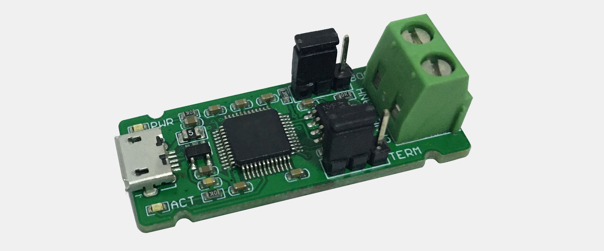

***Cando*** 是一款低成本的，简单好用的USB-CAN转换模块，支持Windos、Linux、树莓派等系统。USB通信基于USB buck传输，保证了高速通信下的速度和稳定，并且在Windos、Linux系统均无需安装驱动。因为我们在Windows系统适配了微软自带WCID(**W**indows **C**ompatible **ID**) 驱动。在Linux系统适配了socketcan接口，您可以直接使用can-utils工具进行操作。

关键特性：

- CPU 32bit Cortex-M0
- 采用内部晶振，配合USB通讯自动校准
- 电源LED指示灯，通信LED指示灯
- 采用Micro-USB接口供电和通信
- 内部自恢复保险丝，防止损坏主机USB口
- 螺旋接线端子 CANH, CANL
- 2.54跳线帽 BOOT 选择
- 2.54跳线帽 CAN 终端电阻选择
- 超小尺寸 4 x 1.6 cm
- USB2.0 Full Speed (12Mbps)
- 支持最大32个设备同时连接电脑工作
- 支持测试模式：Silent、Loopback
- 支持用户自定义CAN 波特率和采样点
- 支持 CAN 2.0A (11-bit ID) 和 2.0B (29-bit ID) 最大波特率 1Mbps
- 配套的调试软件 ***microbus***
- 提供 Windows 二次开发 dll 和 demo (Qt)
- 提供 Python 二次开发包，支持Windows、Linux、OS X、树莓派、Windows CE、Android

尺寸：

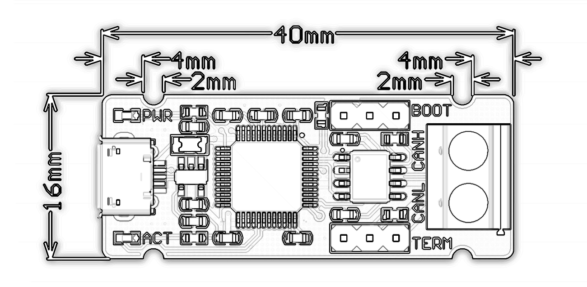

布局：

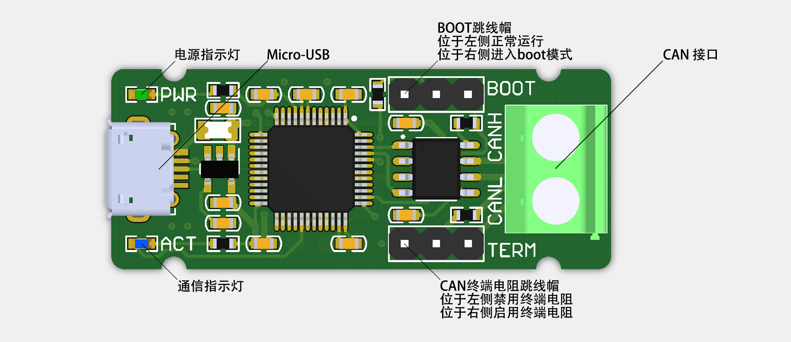

## 1.2 Cando_pro

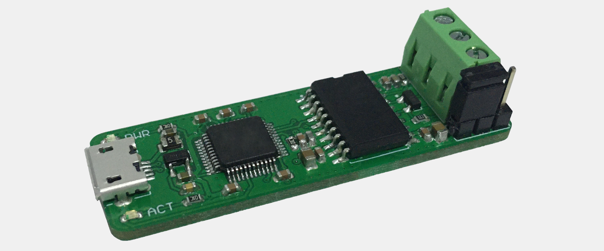

***Cando_pro*** 是***Cando***的升级版本，使用了高度集成的全隔离芯片 2.5KV rms 信号和电源隔离，同时增加了更多的硬件保护电路，抗干扰能力更强，适合工业调试应用或电机类应用。同样支持Windos、Linux、树莓派等系统。USB通信基于USB buck传输，保证了高速通信下的速度和稳定，并且在Windos、Linux系统均无需安装驱动。因为我们在Windows系统适配了微软自带WCID(**W**indows **C**ompatible **ID**) 驱动。在Linux系统适配了socketcan接口，您可以直接使用can-utils工具命令对 ***cando*** 操作。

关键特性：

- CPU 32bit Cortex-M0
- 采用内部晶振，配合USB通讯自动校准
- 电源LED指示灯，通信LED指示灯
- 采用Micro-USB接口供电和通信
- 内部自恢复保险丝，防止损坏主机USB口
- 螺旋接线端子 CANH, CANL，GND
- 2.54跳线帽 CAN 终端电阻选择
- 2.5KV rms 信号和电源隔离
- CAN 接口保护
- 超小尺寸 5 x 1.6 cm
- USB2.0 Full Speed (12Mbps)
- 支持最大32个设备同时连接电脑工作
- 支持测试模式：Silent、Loopback
- 支持用户自定义CAN 波特率和采样点
- 支持 CAN 2.0A (11-bit ID) 和 2.0B (29-bit ID) 最大波特率 1Mbps
- 配套的调试软件 ***microbus***
- 提供 Windows 二次开发 dll 和 demo (Qt)
- 提供 Python 二次开发包，支持Windows、Linux、OS X、树莓派、Windows CE、Android

尺寸：

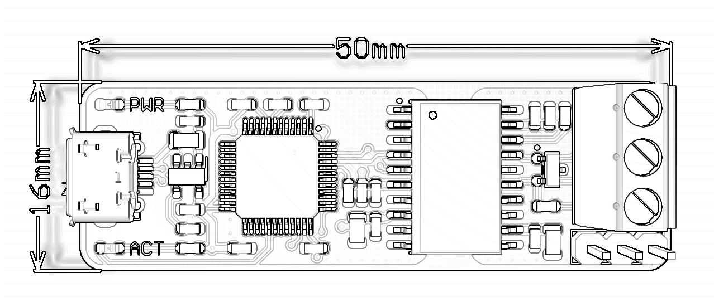

布局：

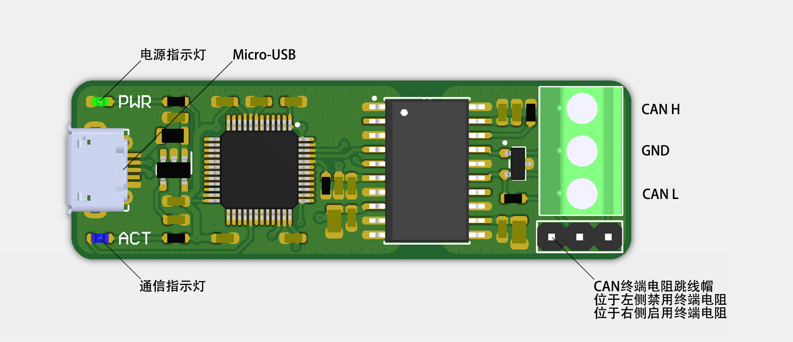

# 2 microbus: CAN总线调试软件 (适用于Windows, Linux)

## 2.1 microbus 简介

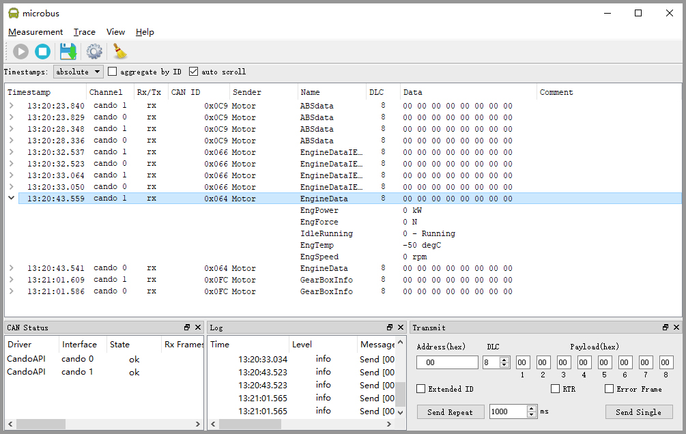

***microbus*** 是 ***Cando & Cando_pro*** 专用的、简单易用的can总线调试软件，麻雀虽小五脏俱全，对于一般的can调试开发完全够用，而且专门针对汽车逆向工程增加了通过can id分类接收到的can数据帧，并且当某个id的数据帧活跃时会进行高亮显示以便于观察分析。

- 支持 Windos/Linux (Ubuntu发行版本)
- 最大支持同时接入32个 ***Cando 或 Cando_pro*** 模块
- 数据帧时间戳
- 支持数据日志保存
- 支持 CAN DBC 文件协议解析
- 软件绿色免安装 

## 2.2 microbus 使用说明

### 2.2.1 将Cando或Cando_pro连接电脑

使用 micro-usb 数据线连接 ***Cando 或 Cando_pro*** 和电脑，此时ACT指示灯将闪烁两下然后熄灭以此指示模块自检完成已经正常运行，同时PWR指示灯常亮。

### 2.2.2 运行 microbus

***Windos***

下载microbus_x_x_x_dist_win32([下载链接](https://github.com/codenocold/microbus/releases/download/v0.2.1/microbus_0_2_1_dist_win32.rar))，下载完成后解压生成 microbus_x_x_x_dist_win32 文件夹，进入文件夹双击 microbus.exe 运行软件。***注意：***由于win8以前的系统默认不支持WCID(**W**indows **C**ompatible **ID**), 所以模块接入电脑后显示黄色感叹号，需要使用工具软件Zadig([下载链接](https://github.com/codenocold/microbus/releases/download/v0.2.1/zadig-2.4.exe))自动安装一下WCID驱动即可。

Windows启动后界面：

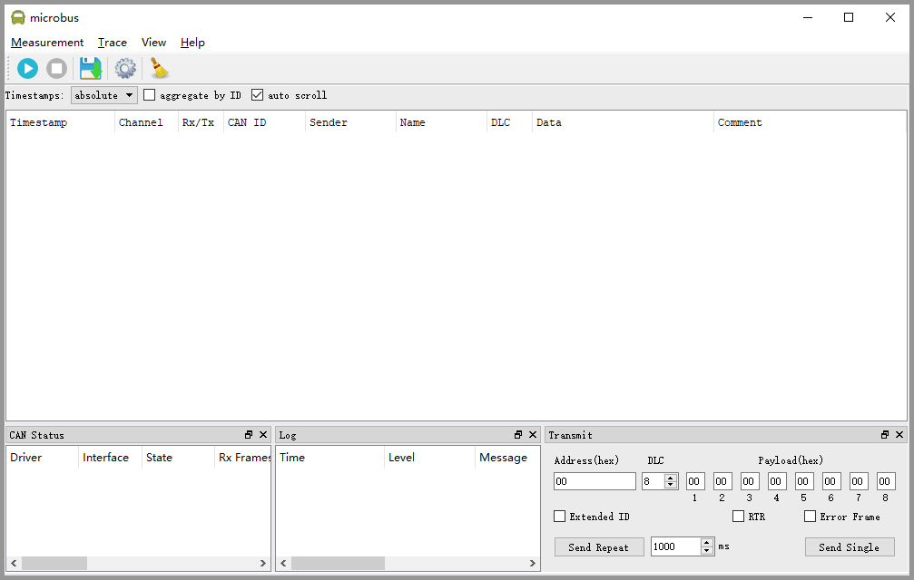

***Ubuntu***

下载microbus_x_x_x_dist_ubuntu([下载链接](https://github.com/codenocold/microbus/releases/download/v0.2.1/microbus_0_2_1_dist_ubuntu.rar))，下载完成后解压生成 microbus_x_x_x_dist_ubuntu文件夹。
在命令行输入以下命令回车进行libnl库的安装。

```shell
sudo apt-get install libnl-route-3-dev
```
进入microbus_dist_ubuntu文件夹下，将 canifconfig、microbus 文件增加可**执行权限**，然后以**管理员权限**运行 microbus
```shell
sudo ./microbus
```
Ubuntu启动后界面：


### 2.2.3 启动 Cando 或 Cando_pro

microbus 启动后的界面：

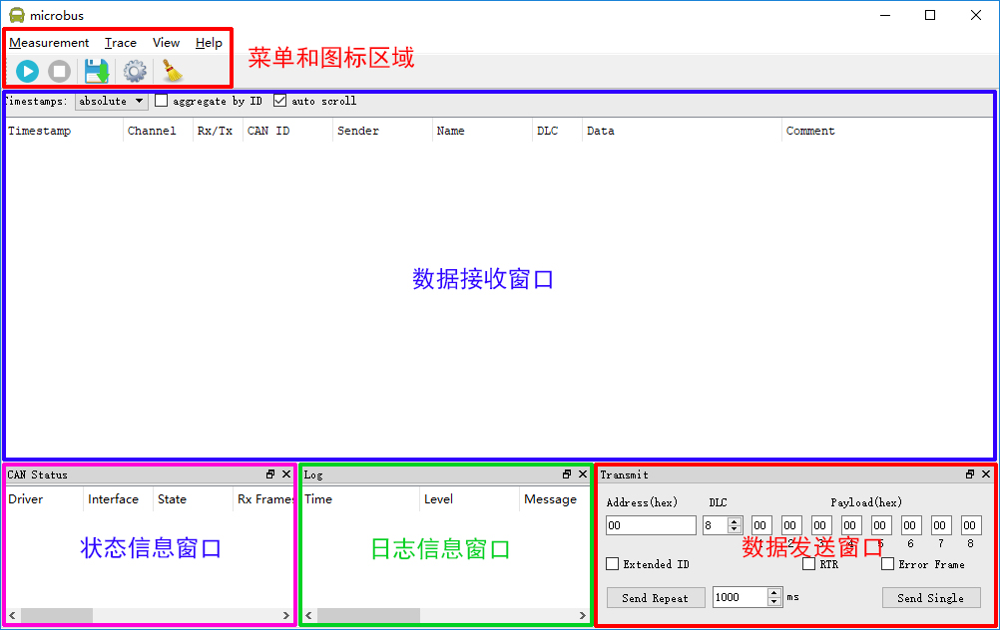

点击左上角开始按钮进入设置界面：

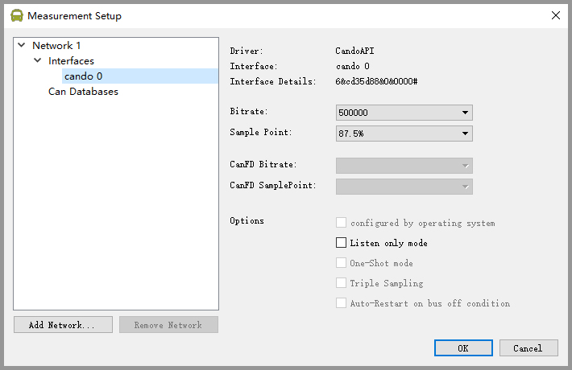

点击左侧列表中的 cando 0 进行波特率、采样点、工作模式等相关设置，然后点击 OK, 此时cando模块上的 ACT 指示灯亮起指示端口已处于工作状态，此时就可以进行CAN数据的收发操作了。

### 2.2.3 加载 CAN DBC 文件

通过点击设置按钮或开始工作按钮，进入设置界面：

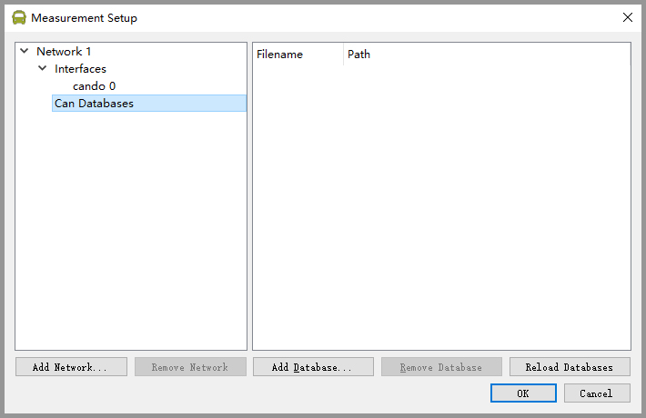

点击左侧列表中 Interfaces 下的 Can Databases，然后点击右侧Add Database... 按钮，添加 DBC 文件：

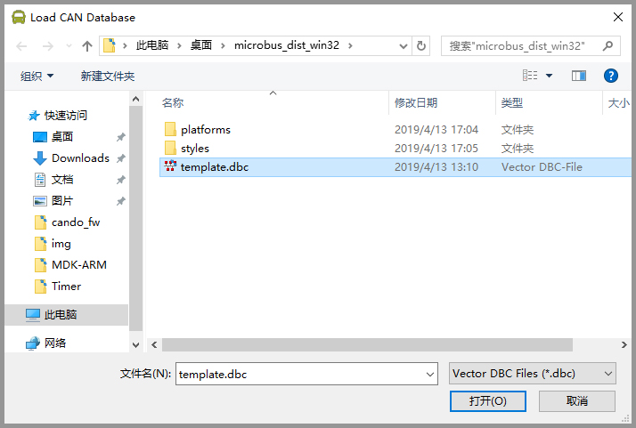

添加完成后当接收到相应的数据帧时将在接收窗口中显示解析到的相关信息：

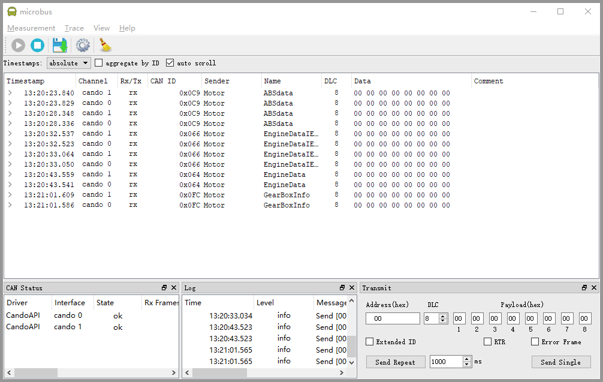

可以通过点击接收窗口中的各个数据帧展开查看详细信息


# 3 SocketCAN (只适用于Linux)

SocketCAN是Linux的CAN驱动程序和网络工具的集合。 它允许以与其他网络设备类似的方式与CAN总线设备连接。 这使开发人员可以编写支持多种CAN总线接口的代码。 不幸的是，SocketCAN仅在Linux上有效。

## 3.1 Linux下CAN设备的基本操作

您可以在命令终端中通过命令来查看、配置、启动、关闭can设备。

### 3.1.1 查看can设备

在命令终端中输入：

```shell
ifconfig -a
```

得到如下结果：

```shell
can0: flags=193<UP,RUNNING,NOARP>  mtu 16
        unspec 00-00-00-00-00-00-00-00-00-00-00-00-00-00-00-00  txqueuelen 10  (UNSPEC)
        RX packets 14  bytes 112 (112.0 B)
        RX errors 0  dropped 0  overruns 0  frame 0
        TX packets 0  bytes 0 (0.0 B)
        TX errors 0  dropped 0 overruns 0  carrier 0  collisions 0

enp9s0: flags=4099<UP,BROADCAST,MULTICAST>  mtu 1500
        ether 78:45:c4:b8:d2:b5  txqueuelen 1000  (Ethernet)
        RX packets 0  bytes 0 (0.0 B)
        RX errors 0  dropped 0  overruns 0  frame 0
        TX packets 0  bytes 0 (0.0 B)
        TX errors 0  dropped 0 overruns 0  carrier 0  collisions 0
```

第一个can0就是我们的Cando或Cando_pro设备了。

### 3.1.2 设置can设备的波特率

在命令终端中输入：(以下命令将can0设备的波特率设定为 500000 bps)

```shell
sudo ip link set can0 type can bitrate 500000
```

### 3.1.3 启动can设备

在命令终端中输入：

```shell
sudo ip link set up
```

### 3.1.4 关闭can设备

在命令终端中输入：

```shell
sudo ip link set down
```

## 3.2 SocketCAN实用程序

当can设备启用后，将可以使用许多实用程序，来进行can通信了。首先我们通过在命令终端中输入以下命令来安装can-utils：

```shell
sudo apt-get install can-utils
```

### 3.2.1 candump

candump可以实时显示接收到的can消息。 要实时显示设备can0上的所有can消息，在命令终端中输入以下命令：

```shell
candump can0
```

candump还可以使用掩码和标识符对接收到的can信息进行过滤。 有两种过滤器类型：

- [can_id]:[can_mask] ：当 [received_can_id] & [can_mask] == [can_id] & [mask] 被显示

- [can_id]~[can_mask] ：当 [received_can_id] & [can_mask] != [can_id] & [mask] 被显示

例如：

仅显示can0上收到的ID为0x123的消息：

```shell
candump vcan0,0x123:0x7FF
```

仅显示can0上收到的ID为0x123或0x456的消息：

```shell
candump vcan0,0x123:0x7FF,0x456:0x7FF 
```

### 3.2.2 cansend

cansend可以将单个CAN帧发送到总线上。 您将必须指定设备，标识符和要发送的数据字节。 例如：

```shell
cansend can0 123#1122334455667788
```

此条指令将在接口can0上发送一条消息，其标识符为0x123，数据字节为[0x11、0x22、0x33、0x44、0x55、0x66、0x77、0x88]。 请注意，此工具始终假定值以十六进制给出。

### 3.2.3 cangen

cangen可以生成随机的CAN数据，这对于测试很有用。 有关更多的用法信息，请在命令终端中输入：

```shell
cangen --help
```

### 3.2.4 cansniffer

cansniffer可以显示总线上接收到的CAN消息，而且可以过滤掉数据不变的帧。 这对于逆向工程CAN总线系统非常有用。 有关更多信息，请在命令终端中输入：

```shell
cansniffer --help
```

## 3.3 使用SocketCAN二次开发

由于Cando和Cando_pro完全兼容SocketCAN，所以我们通过SocketCAN对Cando和Cando_pro二次开发变得非常方便。它使用标准的网络套接字，这意味着可以用许多不同的语言进行开发。

### 3.3.1 使用系统API (C 语言)

应用程序首先通过初始化一个套接字（与TCP / IP通信中的情况非常类似），然后将该套接字绑定到一个接口（或所有接口，如果应用程序需要），来设置对CAN接口的访问。 一旦绑定，套接字就可以进行读取，写入等操作，像UDP套接字一样使用。

二次开发前需要安装can_dev模块并配置CAN总线波特率，然后启用。例如：

```shell
$ modprobe can_dev
$ modprobe can
$ modprobe can_raw
$ sudo ip link set can0 type can bitrate 500000
$ sudo ip link set up can0
```

还有一个用于测试目的的虚拟CAN驱动程序，可以使用以下命令在Linux中加载和创建：

```shell
$ modprobe can
$ modprobe can_raw
$ modprobe vcan
$ sudo ip link add dev vcan0 type vcan
$ sudo ip link set up vcan0
$ ip link show vcan0
3: vcan0: <NOARP,UP,LOWER_UP> mtu 16 qdisc noqueue state UNKNOWN 
    link/can
```

以下代码段是SocketCAN API的工作示例，该API使用原始接口发送数据包：

```c
#include <stdio.h>
#include <stdlib.h>
#include <unistd.h>
#include <string.h>

#include <net/if.h>
#include <sys/types.h>
#include <sys/socket.h>
#include <sys/ioctl.h>

#include <linux/can.h>
#include <linux/can/raw.h>

int main(void)
{
	int s;
	int nbytes;
	struct sockaddr_can addr;
	struct can_frame frame;
	struct ifreq ifr;

	const char *ifname = "vcan0";

	if((s = socket(PF_CAN, SOCK_RAW, CAN_RAW)) < 0) {
		perror("Error while opening socket");
		return -1;
	}

	strcpy(ifr.ifr_name, ifname);
	ioctl(s, SIOCGIFINDEX, &ifr);
	
	addr.can_family  = AF_CAN;
	addr.can_ifindex = ifr.ifr_ifindex;

	printf("%s at index %d\n", ifname, ifr.ifr_ifindex);

	if(bind(s, (struct sockaddr *)&addr, sizeof(addr)) < 0) {
		perror("Error in socket bind");
		return -2;
	}

	frame.can_id  = 0x123;
	frame.can_dlc = 2;
	frame.data[0] = 0x11;
	frame.data[1] = 0x22;

	nbytes = write(s, &frame, sizeof(struct can_frame));

	printf("Wrote %d bytes\n", nbytes);
	
	return 0;
}
```

### 3.3.2 使用Python

Python 3.3 以后的版本增加了对SocketCAN的支持。开源库[python-can](https://github.com/hardbyte/python-can)可为python 2和python 3 提供SocketCAN支持。具体使用详情请参考 python-can 官方文档。

# 4 使用cando.dll二次开发 (只适用于Windos)

cando.dll 是专门针对Cando和Cando_pro设计的用于二次开发的动态链接库，里边封装了对Cando和Cando_pro的所有操作接口，方便我们快速进行二次开发。cando.dll 是使用MinGW-win32进行编译构建的。注意：cando.dll 只适用于Windos下使用。

***cando_dll.rar*** [下载链接](https://github.com/codenocold/microbus/releases/download/v0.2.1/cando_dll.rar)

## 4.1 内部变量和结构体

### 4.1.1 CAN 工作模式标志位

`CANDO_MODE_NORMAL` 正常工作模式
`CANDO_MODE_LISTEN_ONLY` CAN 侦听模式
`CANDO_MODE_LOOP_BACK` CAN 回环模式
`CANDO_MODE_ONE_SHOT` CAN 发送失败后不自动重新发送模式
`CANDO_MODE_NO_ECHO_BACK` CAN 发送数据帧后不向电脑返回echo帧 (默认为返回echo帧)

### 4.1.2 CAN ID 标志位

`CANDO_ID_MASK`用于和 Frame.can_id 按位`与`运算，得到 can id
`CANDO_ID_EXTENDED` 用于和 Frame.can_id 按位`与`运算，判断是否为扩展帧
`CANDO_ID_RTR` 用于和 Frame.can_id 按位`与`运算，判断是否为远程帧
`CANDO_ID_ERR` 用于和 Frame.can_id 按位`与`运算，判断是否错误帧

### 4.1.3 CAN 总线错误标志位

`CAN_ERR_BUSOFF` 离线错误
`CAN_ERR_RX_TX_WARNING` 发送或接收错误报警
`CAN_ERR_RX_TX_PASSIVE` 发送或接收被动错误
`CAN_ERR_OVERLOAD` 总线过载
`CAN_ERR_STUFF` 填充规则错误
`CAN_ERR_FORM` 格式错误
`CAN_ERR_ACK` 应答错误
`CAN_ERR_BIT_RECESSIVE` 位隐性错误
`CAN_ERR_BIT_DOMINANT` 位显性错误
`CAN_ERR_CRC` CRC校验错误

### 4.1.4 cando_frame_t 数据帧结构体

```c
uint32_t echo_id	// 判断是否为发送的 ECHO 帧，ECHO 帧时值为 0，否则为 0xFFFFFFFF
uint32_t can_id		// 帧ID，用于判断帧类型，和`CANDO_ID_MASK`按位`与`运算得到can id
uint8_t can_dlc 	// can数据长度，0~8
uint8_t channel 	// 用于内部通信，用户无需理会
uint8_t flags;      // 用于内部通信，用户无需理会
uint8_t reserved;	// 暂未使用，用户无需理会
uint8_t data[8];	// can数据
uint32_t timestamp_us;	// can 数据时间戳，单位为 us
```

### 4.1.5 cando_bittiming_t CAN波特率配置结构体

```c
uint32_t prop_seg		// propagation Segment (固定为 1)
uint32_t phase_seg1		// phase segment 1 (1~15)
uint32_t phase_seg2		// phase segment 2 (1~8)
uint32_t sjw			// synchronization segment (1~4)
uint32_t brp			// CAN时钟分频 (1~1024)，内部CAN时钟为 48MHz 
```

如果您不需要自己设定特殊的can波特率或采样点请参考 cando_example 源码中的常见波特率配置表。

## 4.2 接口说明

### 4.2.1 设备列表相关接口

#### 4.2.1.1 cando_list_malloc

```c
bool cando_list_malloc(cando_list_handle *list)
```

- **函数说明：**创建设备列表
- ***list：**设备列表句柄指针，类型为 cando_list_handle *
- **返回值：**True，成功；False，失败

#### 4.2.1.2 cando_list_free

```c
bool cando_list_free(cando_list_handle list)
```

- **函数说明：**释放设备列表
- **list：**设备列表句柄，类型为 cando_list_handle
- **返回值：**True，成功；False，失败

#### 4.2.1.3 cando_list_scan

```c
bool cando_list_scan(cando_list_handle list)
```

- **函数说明：**扫描当前电脑连接的所有Cando或Cando_pro设备
- **list：**设备列表句柄，类型为 cando_list_handle
- **返回值：**True，成功；False，失败

#### 4.2.1.4 cando_list_num

```c
bool cando_list_num(cando_list_handle list, uint8_t *num)
```

- **函数说明：**获取扫描到的Cando或Cando_pro设备的数量
- **list：**设备列表句柄，类型为 cando_list_handle
- ***num：**存储设备数量的变量指针
- **返回值：**True，成功；False，失败

### 4.2.2 设备操作相关接口

#### 4.2.2.1 cando_malloc

```c
bool cando_malloc(cando_list_handle list, uint8_t index, cando_handle *hdev)
```

- **函数说明：**创建设备实例
- **list：**设备列表句柄，类型为 cando_list_handle
- **index：**想要创建设备位于设备列表中的索引值，从 0 开始
- ***hdev：**设备句柄指针，类型为 cando_handle *
- **返回值：**True，成功；False，失败

#### 4.2.2.2 cando_free

```c
bool cando_free(cando_handle hdev)
```

- **函数说明：**释放设备实例
- **hdev：**设备句柄，类型为 cando_handle
- **返回值：**True，成功；False，失败

#### 4.2.2.3 cando_open

```c
bool cando_open(cando_handle hdev)
```

- **函数说明：**打开设备USB通信通道
- **hdev：**设备句柄，类型为 cando_handle
- **返回值：**True，成功；False，失败

#### 4.2.2.4 cando_close

```c
bool cando_close(cando_handle hdev)
```

- **函数说明：**关闭设备USB通信通道
- **hdev：**设备句柄，类型为 cando_handle
- **返回值：**True，成功；False，失败

#### 4.2.2.5 cando_get_serial_number_str

```c
wchar_t cando_get_serial_number_str(cando_handle hdev)
```

- **函数说明：**获取设备序列号字符串
- **hdev：**设备句柄，类型为 cando_handle
- **返回值：**设备序列号字符串，类型为 wchar_t

#### 4.2.2.6 cando_get_dev_info

```c
bool cando_get_dev_info(cando_handle hdev, uint32_t *fw_version, uint32_t *hw_version)
```

- **函数说明：**获取设备的固件和硬件版本信息
- **hdev：**设备句柄，类型为 cando_handle
- ***fw_wersion：**存储设备固件版本的变量指针，如：32 表示 v3.2
- ***hw_wersion：**存储设备硬件版本的变量指针，如：12 表示 v3.2
- **返回值：**True，成功；False，失败

#### 4.2.2.7 cando_set_timing

```c
bool cando_set_timing(cando_handle hdev, cando_bittiming_t *timing)
```

- **函数说明：**配置CAN波特率相关信息
- **hdev：**设备句柄，类型为 cando_handle
- ***timing：**CAN波特率配置结构体指针，参考[cando_bittiming_t](###4.1.5 cando_bittiming_t CAN波特率配置结构体)
- **返回值：**True，成功；False，失败

#### 4.2.2.8 cando_start

```c
bool cando_start(cando_handle hdev, uint32_t mode)
```

- **函数说明：**启动Cando或Cando_pro
- **hdev：**设备句柄，类型为 cando_handle
- **mode：**CAN工作模式，参考[CANDO_MODE_*](###4.1.1 CAN 工作模式标志位)
- **返回值：**True，成功；False，失败

#### 4.2.2.9 cando_stop

```c
bool cando_stop(cando_handle hdev)
```

- **函数说明：**停止Cando或Cando_pro
- **hdev：**设备句柄，类型为 cando_handle
- **返回值：**True，成功；False，失败

#### 4.2.2.10 cando_frame_send

```c
bool cando_frame_send(cando_handle hdev, cando_frame_t *frame)
```

- **函数说明：**发送CAN数据帧
- **hdev：**设备句柄，类型为 cando_handle
- ***frame：**数据帧结构体指针，参考[cando_frame_t](###4.1.4 cando_frame_t 数据帧结构体)
- **返回值：**True，成功；False，失败

#### 4.2.2.11 cando_frame_read

```c
bool cando_frame_read(cando_handle hdev, cando_frame_t *frame, uint32_t timeout_ms)
```

- **函数说明：**读取CAN数据帧
- **hdev：**设备句柄，类型为 cando_handle
- ***frame：**数据帧结构体指针，参考[cando_frame_t](###4.1.4 cando_frame_t 数据帧结构体)
- **返回值：**True，成功；False，失败

### 4.2.3 辅助功能接口

#### 4.2.3.1 cando_parse_err_frame

```c
bool cando_parse_err_frame(cando_frame_t *frame, uint32_t *err_code, uint8_t *err_tx, uint8_t *err_rx)
```

- **函数说明：**解析错误数据帧的错误信息
- ***frame：**错误数据帧结构体指针，参考[cando_frame_t](###4.1.4 cando_frame_t 数据帧结构体)
- ***err_code：**CAN总线错误代码，参考[CAN_ERR_*](###4.1.3 CAN 总线错误标志位)
- ***err_tx：**CAN总线发送错误计数
- ***err_rx：**CAN总线接收错误计数
- **返回值：**True，成功；False，失败

## 4.3 cando_example (cando.dll 应用Demo)

为了方便大家对cando.dll的使用有一个更直观的了解，我们还特意编写了一个基于cando.dll的名为cando_example（一个简单的can调试助手）的工程示例，cando_example是使用Qt进行编写的，并且源代码开放，以供大家参考使用 cando.dll 并编写自己的can调试应用软件。虽然是Demo工程，我们仍然追求精益求精，投入了大量精力，尽量让这个Demo具有除了参考使用cando.dll之外还能带来更多的价值。

cando_example [下载链接](https://github.com/codenocold/microbus/releases/download/v0.2.1/cando_example.rar)

cando_example 源代码 [下载链接](https://github.com/codenocold/microbus/releases/download/v0.2.1/cando_example_sourcecode.rar)

cando_example 运行界面：

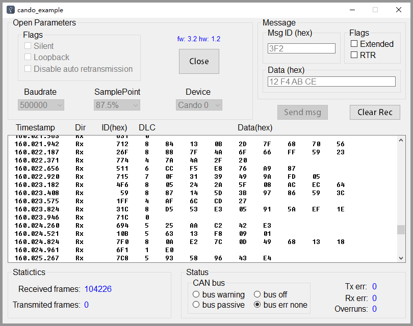

# 5 使用Python库二次开发 (适用于Windows, Linux)

cando Python库是基于 Python3 编写的，通过几个简单的函数便可以完成和 usb 转 can 模块（Cando 或者 Cando_pro）的通信，进行高效的 CAN 工具开发。

cando 后台 usb 通信是基于 libusb 进行的，所以使用前请首先安装 libusb 驱动。

**Windows** 推荐使用 Zadig 工具进行安装。

1. 下载 Zadig [下载链接](https://github.com/codenocold/microbus/releases/download/v0.2.1/zadig-2.4.exe)
2. 将 Cando 或 Cando_pro 连接电脑
3. 双击运行 zadig-x.x.exe
4. 点击菜单栏中的 `Options` -> `List All Devices` 然后点击菜单栏下方的下拉列表，选择 Cando 或 Cando_pro
5. 选择下方的驱动为 libusb-win32 ，然后点击 `Replace Driver` ，等待安装完成即可

**Linux** Ubuntu18.04 默认已安装 libusb 无需安装，其他发行版本请根据情况自行安装。

## 5.1 cando Python库安装

推荐通过 Python 包管理工具 **pip** 进行安装，pip的安装请自行Google。

在命令终端中输入如下命令进行 cando Python 库安装：

```shell
pip install cando
```

## 5.2 内部常量

### 5.2.1 CAN 工作模式标志位

`CANDO_MODE_NORMAL` 正常工作模式
`CANDO_MODE_LISTEN_ONLY` CAN 侦听模式
`CANDO_MODE_LOOP_BACK` CAN 回环模式
`CANDO_MODE_ONE_SHOT` CAN 发送失败后不自动重新发送模式
`CANDO_MODE_NO_ECHO_BACK` CAN 发送数据帧后不向电脑返回echo帧 (默认为返回echo帧)

### 5.2.2 CAN ID 标志位

`CANDO_ID_MASK`用于和 Frame.can_id 按位`与`运算，得到 can id
`CANDO_ID_EXTENDED` 用于和 Frame.can_id 按位`与`运算，判断是否为扩展帧
`CANDO_ID_RTR` 用于和 Frame.can_id 按位`与`运算，判断是否为远程帧
`CANDO_ID_ERR` 用于和 Frame.can_id 按位`与`运算，判断是否错误帧

### 5.2.3 CAN 错误标志位

`CAN_ERR_BUSOFF` 离线错误
`CAN_ERR_RX_TX_WARNING` 发送或接收错误报警
`CAN_ERR_RX_TX_PASSIVE` 发送或接收被动错误
`CAN_ERR_OVERLOAD` 总线过载
`CAN_ERR_STUFF` 填充规则错误
`CAN_ERR_FORM` 格式错误
`CAN_ERR_ACK` 应答错误
`CAN_ERR_BIT_RECESSIVE` 位隐性错误
`CAN_ERR_BIT_DOMINANT` 位显性错误
`CAN_ERR_CRC` CRC校验错误

## 5.3 数据帧类

`Class Frame` 内部只有以下成员变量：

* echo_id :  判断是否为发送的 ECHO 帧，ECHO 帧时值为 0，否则为 0xFFFFFFFF
* can_id : 帧ID，用于判断帧类型，和`CANDO_ID_MASK`按位`与`运算得到can id
* can_dlc :  can数据长度，0~8
* channel :  用于内部通信，用户无需理会
* flags : 用于内部通信，用户无需理会
* reserved : 暂未使用，用户无需理会
* data :  can数据，类型为长度为8的列表
* timestamp_us : can 数据时间戳，单位为 us

## 5.4 内部函数

`list_scan()` 
    扫描当前连接到电脑的所有设备
    :return: 设备句柄的列表

`dev_start(dev, mode=0)` 
    启动设备，启动后Cando 或 Cando_pro 上的蓝灯亮起
    :param dev: 设备句柄
    :param mode: 启动模式标志，可以是 ***CAN 工作模式标志位***  的任意按位`或`运算组合，默认为正常工作模式
    :return: 无

`dev_stop(dev)`
    关闭设备，关闭后Cando 或 Cando_pro 上的蓝灯熄灭
    :param dev: 设备句柄
    :return: 无

`dev_set_timing(dev, prop_seg, phase_seg1, phase_seg2, sjw, brp)`
    设置 CAN 的波特率和采样点
    :param dev: 设备句柄
    :param prop_seg: propagation Segment (固定为 1)
    :param phase_seg1: phase segment 1 (1~15)
    :param phase_seg2: phase segment 2 (1~8)
    :param sjw: synchronization segment (1~4)
    :param brp: CAN时钟分频 (1~1024)，内部CAN时钟为 48MHz 
    :return: 无

`dev_get_serial_number_str(dev)`
    获取设备序列号字符串
    :param dev: 设备句柄
    :return: 设备序列号字符串

`dev_get_dev_info_str(dev)`
    获取设备固件、硬件版本信息字符串
    :param dev: 设备句柄
    :return: 设备固件、硬件版本信息字符串

`parse_err_frame(frame)`
    解析错误帧的错误信息
    :param frame: 错误帧
    :return: (错误代码，发送错误计数，接收错误计数)，错误代码参考 ***CAN 错误标志位***

`dev_frame_send(dev, frame)`
    发送帧数据
    :param dev: 设备句柄
    :param frame: 数据帧类，参考 ***can 数据帧类***
    :return: 无

`dev_frame_read(dev, frame, timeout_ms)`
    读取帧数据，读取到的数据帧将会赋值到传入的 frame 中
    :param dev: 设备句柄
    :param frame: 数据帧类，参考 ***can 数据帧类***
    :param timeout_ms: 读取超时时间，单位为 ms
    :return: 如果读取成功返回 True 否则 返回 False

## 5.5 开始编程

### 5.5.1 列出连接的设备

```py
import sys
from cando import *

# 获取设备列表
dev_lists = list_scan()

# 打印扫描到的Cando或Cando_pro的设备信息
if len(dev_lists):
    for dev in dev_lists:
        # 获取设备序列号
        serial_number = dev_get_serial_number_str(dev)
        # 获取设备版本信息
        dev_info = dev_get_dev_info_str(dev)
        # 打印设备信息
        print("Serial Number: " + serial_number + ', Dev Info: ' + dev_info)
else:
    print("Device not found!")
    sys.exit(0)

```

运行得到输出结果：(电脑连接两个Cando或Cando_pro)

```py
Serial Number: 004F00295734571020343132, Dev Info: fw: 3.2 hw: 1.2
Serial Number: 0028002B5734571020343132, Dev Info: fw: 3.2 hw: 1.2

Process finished with exit code 0
```

### 5.5.2 发送数据

```py
import sys
import time
from cando import *

# 获取设备列表
dev_lists = list_scan()

# 判断是否发现设备
if len(dev_lists) == 0:
    print("Device not found!")
    sys.exit(0)

# 设置波特率：500K 采样点：87.5%
dev_set_timing(dev_lists[0], 1, 12, 2, 1, 6)

# 启动设备
dev_start(dev_lists[0], 0)

# 设置发送的数据帧
send_frame = Frame()
send_frame.can_id = 0x12
# send_frame.can_id |= CANDO_ID_EXTENDED
# send_frame.can_id |= CANDO_ID_RTR
send_frame.can_dlc = 8
send_frame.data = [0x01, 0x02, 0x03, 0x04, 0x05, 0x06, 0x07, 0x08]

# 循环发送 500 条数据帧
for i in range(500):
    # 发送数据帧
    dev_frame_send(dev_lists[0], send_frame)
    time.sleep(0.001)  # 睡眠 1 ms

    # 读取数据帧，因为发送成功后 Cando 将返回 ECHO 帧，如果不进行读取，会阻塞通道，造成无法继续发送
    rec_frame = Frame()
    dev_frame_read(dev_lists[0], rec_frame, 100)

# 停止设备
dev_stop(dev_lists[0])

```

### 5.5.3 接收数据

```py
import sys
from cando import *

# 获取设备列表
dev_lists = list_scan()

# 判断是否发现设备
if len(dev_lists) == 0:
    print("Device not found!")
    sys.exit(0)

# 设置波特率：500K 采样点：87.5%
dev_set_timing(dev_lists[0], 1, 12, 2, 1, 6)

# 启动设备
dev_start(dev_lists[0], 0)

# 创建接收数据帧
rec_frame = Frame()

# 阻塞读取数据
print("Reading...")
while True:
    if dev_frame_read(dev_lists[0], rec_frame, 10):
        break

if rec_frame.can_id & CANDO_ID_ERR:    # 错误帧处理
    error_code, err_tx, err_rx = parse_err_frame(rec_frame)
    print("Error: ")
    if error_code & CAN_ERR_BUSOFF:
        print("    CAN_ERR_BUSOFF")
    if error_code & CAN_ERR_RX_TX_WARNING:
        print("    CAN_ERR_RX_TX_WARNING")
    if error_code & CAN_ERR_RX_TX_PASSIVE:
        print("    CAN_ERR_RX_TX_PASSIVE")
    if error_code & CAN_ERR_OVERLOAD:
        print("    CAN_ERR_OVERLOAD")
    if error_code & CAN_ERR_STUFF:
        print("    CAN_ERR_STUFF")
    if error_code & CAN_ERR_FORM:
        print("    CAN_ERR_FORM")
    if error_code & CAN_ERR_ACK:
        print("    CAN_ERR_ACK")
    if error_code & CAN_ERR_BIT_RECESSIVE:
        print("    CAN_ERR_BIT_RECESSIVE")
    if error_code & CAN_ERR_BIT_DOMINANT:
        print("    CAN_ERR_BIT_DOMINANT")
    if error_code & CAN_ERR_CRC:
        print("    CAN_ERR_CRC")
    print("    err_tx: " + str(err_tx))
    print("    err_rx: " + str(err_rx))
else:    # 数据帧处理
    print("Rec Frame: ")
    print("    is_extend    : " + ("True" if rec_frame.can_id & CANDO_ID_EXTENDED else "False"))
    print("    is_rtr       : " + ("True" if rec_frame.can_id & CANDO_ID_RTR else "False"))
    print("    can_id       : " + str(rec_frame.can_id & CANDO_ID_MASK))
    print("    can_dlc      : " + str(rec_frame.can_dlc))
    print("    data         : " + str(rec_frame.data))
    print("    timestamp_us : " + str(rec_frame.timestamp_us))

# 停止设备
dev_stop(dev_lists[0])

```

## 5.6 FAQ

### 5.6.1 为什么安装libusb驱动后，还是无法识别设备

1. 重新插拔设备，使驱动生效。
2. 检查所使用的 usb 数据线是否正常，某些 usb 线内部只有 VCC 和 GND 只是用来充电使用，没有数据通信能力。
3. 检查设备是否正常启动，刚插入 usb 时模块上的蓝色led会闪烁两下，以表示模块正常启动。
4. 重启电脑再次进行尝试。

### 5.6.2 使用 Zadig 安装的 libusb-win32 时 Zadig 无响应

1. Zadig 安装过程可能会有假死现象，只需要耐心等待几分钟，当弹出安装成功对话框时说明安装完成，即可关闭。
2. 强制退出 Zadig ，尝试重新操作。

### 5.6.3 怎么看 Ubuntu 系统中是否已安装 libusb

1. 在命令终端中输入 `sudo dpkg -l` 回车，在列表中查看是否有 libusb。

### 5.6.4 Linux 系统运行时提示 Access denied

1. 使用管理员权限运行即可，因为需要进行USB通信，所以会提示权限不足问题。

# 6 特别说明

如果本文档中的文件下载链接您无法打开或下载速度过慢请使用百度云进行尝试下载，如果仍然无法下载请联系技术支持并留下您的邮箱，我们会把文件打包发送至您的邮箱。

百度云下载链接：

链接：https://pan.baidu.com/s/1Gx0nUHvOJFJO3EC2g3hcsQ 
提取码：a3ha 

技术支持：1107795287@qq.com、codenocold@gmail.com